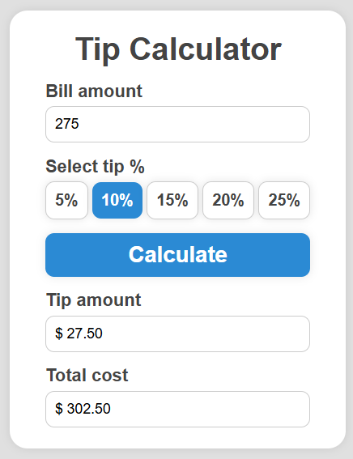

# 💰 Tip Calculator

A responsive and intuitive tip calculator built using **HTML**, **CSS**, and **JavaScript**. This project allows users to quickly calculate the tip amount and total cost based on the bill, and tip percentage.

---

## 🚀 Features

- Real-time tip and total calculation
- User-friendly and responsive design
- Input validation for edge cases
- Clear and elegant UI

---

## 🛠️ Built With

- HTML5
- CSS3 (Flexbox)
- Vanilla JavaScript (ES6+)

---

## 📸 Preview



---

## 🌐 Live Demo

[👉 View Live Demo](https://lu-alvz-dev.github.io/tip-calculator/) 

## 📂 Getting Started

To run this project locally:

```bash
git clone https://github.com/your-username/tip-calculator.git
cd tip-calculator
open index.html
